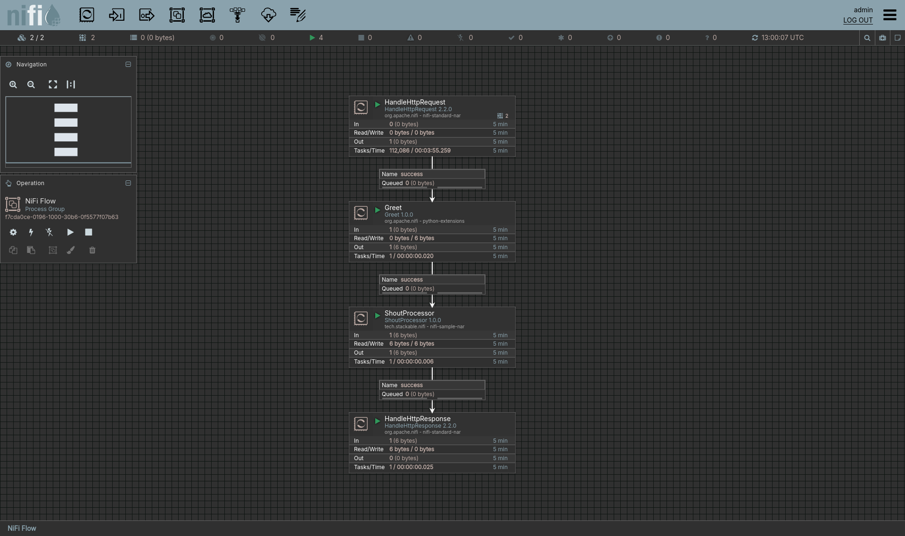

# Overview

This test case configures the Nifi cluster to fetch Python and Java
processors via git-sync. A flow is deployed that include these
processors. The test job triggers the flow and checks the result.

# Custom processors

## Python processor "Greet"

The Greet processor is implemented in Python and answers a request with
the content "Hello!".

## Java processor "Shout"

The Shout processor is implemented in Java and transforms the received
content to uppercase.

# Flow

1. The HandleHttpRequest processor listens for HTTP requests to
   `GET /greeting`. The request is forwarded to the Greet processor.
2. The Greet processor writes the content "Hello!" to the flow file that
   is then forwarded to the Shout processor.
3. The Shout processor transforms the content to uppercase. The flow
   file is forwarded to the HandleHttpResponse processor.
4. The HandleHttpResponse answers the HTTP request with this content.
